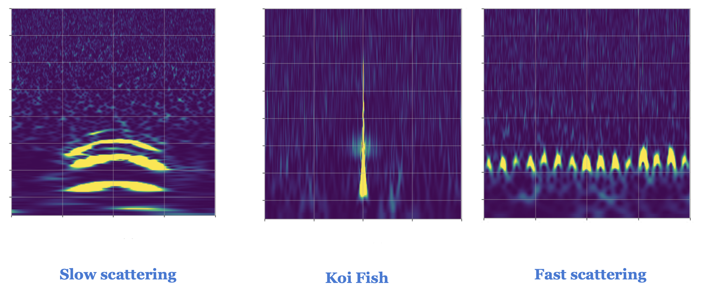

Short duration bursts of energy, also knoown as glitches or triggers, often show up as noise in the Advanced LIGO detectors. These detectors in Livingston, Louisiana and Hanford, Washington in USA detected gravitional waves for the first time in 2015, which led to the 2017 Nobel prize in Physics. You can find more about LIGO at here

In this project, I am using Convolutional Neural Network (CNN) to classify three different types of glitches that very regularly show up in the detector. The algorithm is trained on time-frequency spectrogram images of the three glitch classes as shown here.

